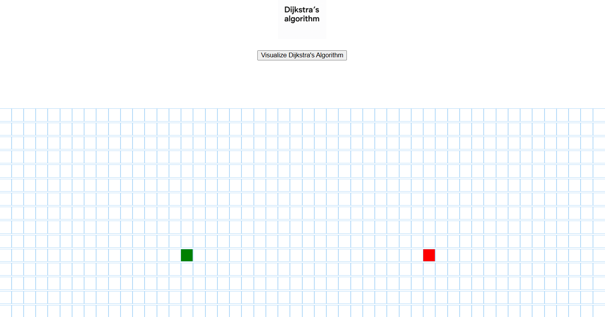
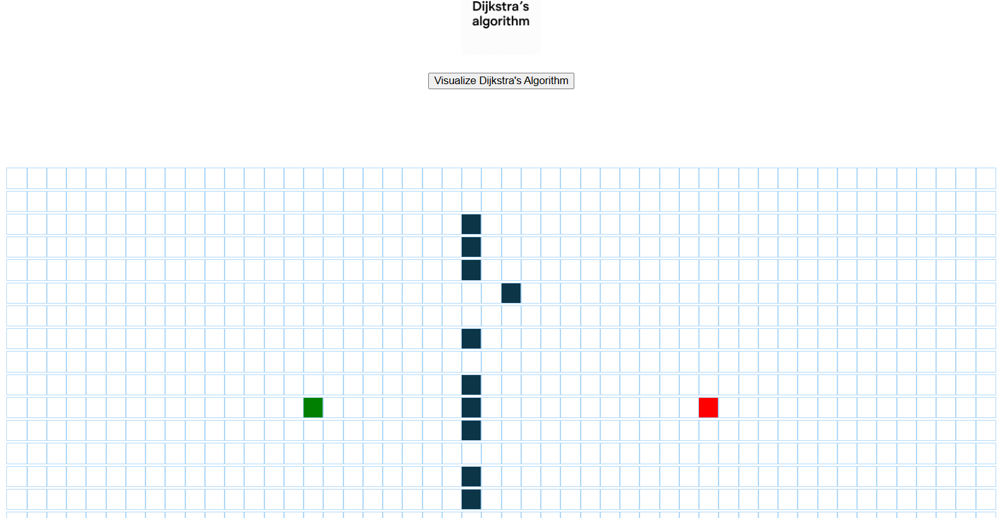
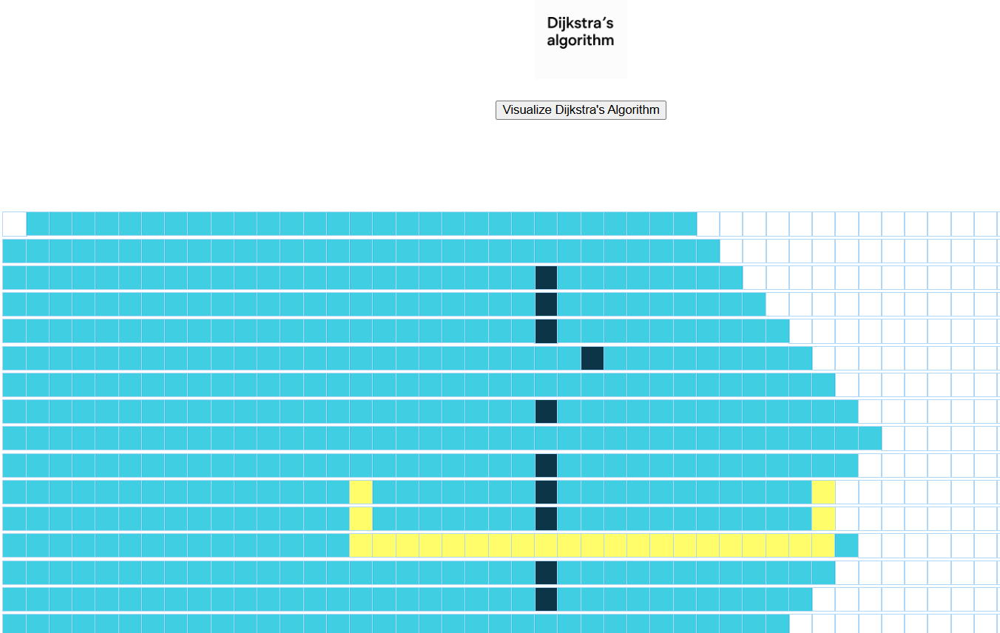

# 🛰️ Dijkstra’s Algorithm Visualizer

An interactive visualizer for **Dijkstra’s Shortest Path Algorithm**, which illustrates how the algorithm finds the shortest path from a source node to all other nodes in a weighted graph. The visualization helps users understand the step-by-step selection of the shortest unvisited node and the path updates to neighbors.

---

## 🧠 Algorithm Used

- **Dijkstra’s Algorithm**  
  A greedy algorithm used to find the shortest path in graphs with non-negative weights.

---

## 📊 Features

- Interactive grid-based interface
- Allows placement of walls (obstacles), source, and destination nodes
- Visual step-by-step traversal with path updates
- Highlights shortest path from source to destination

---

## 📸 Screenshots

### 🔹 Initial Grid Setup and Source and Destination

### 🔹Placement of walls

### 🔹 Final Shortest Path

